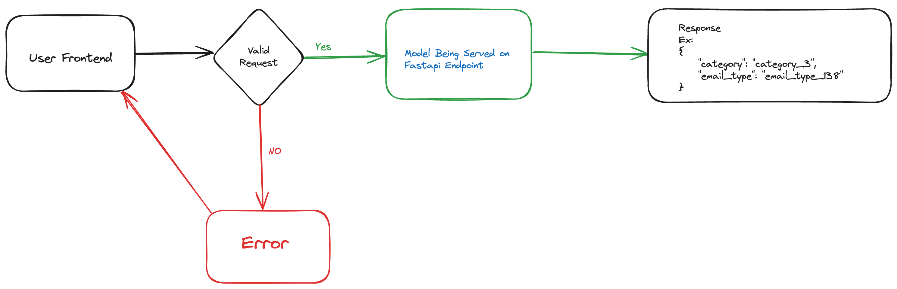
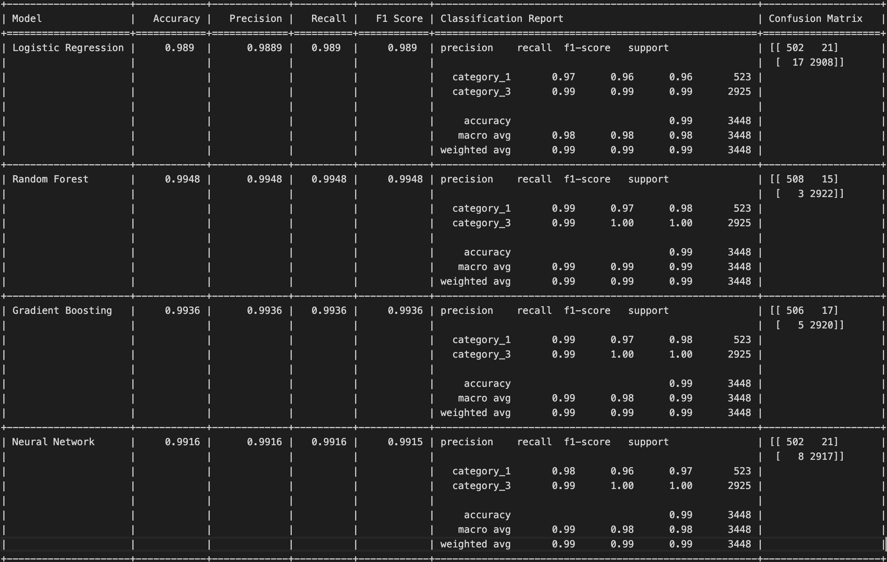

# Email Classifier

The code is organised into training code, which is essentially a python notebook. 

The best models are stored in Models directory along with the vectorizer used in the training. It is important that the same vectorizer is to be used to reproduce the results. 

By running the code `main.py` it launches a fastapi server which serves the model(s) and can be hit using a curl request or from python or using Postman

To run the code:

1. create a virtual environment either with venv or conda

```bash
conda -n "email_classifier" python=3.9
```

```bash
python3 -m venv email_classifier

```

2 . Activate the Virtual environment 

```bash
conda activate email_classifier
```

```bash
source email_classifier/bin/activate
```

3. Install the requirements `pip install -r requirements.txt`. Also the model files except Random Forest for Email type prediction is available in the src/Models directly due to size limitations of git hub it needs to be downloaded to respective directories in src/Models/emailtype from hugging face "Srimouli04/Fl_assignment_models" 
4. See that your current directory is set correctly and run the file `main.py` to start the server. This starts the server on `127.0.0.1:8000/predict`

5. You can run the file `test.py` or you can execute the `curl` command or use postman to execute the request

```python
import requests

url = "http://127.0.0.1:8000/predict"
payload = {
    "text": "DOWNLOAD APP ORIGINAL PRODUCTS CASH ON DELIVERY FREE & EASY RETURNS 100% BUYER PROTECTION Hi, Looks like your Flipkart account has been logged in from a new device. If this is not you, please change your password and log out of all devices immediately. You can do this by accessing the "My Account" section on the Flipkart app or by visiting www.flipkart.com. Thanks, Flipkart Team What Next? Enjoy your shopping! Visit the My Orders page to see your order history. Any Questions? Get in touch with our 24x7 Customer Care team. Flipkart.com 24x7 Customer Support | Buyer Protection | Flexible Payment Options | Largest Collection"
}

response = requests.post(url, json=payload)
print(response.json())
```

Sample Response:
```json
{
    "category": "category_3",
    "email_type": "email_type_1"
}
```

```bash
curl -X POST "http://127.0.0.1:8000/predict" -H "Content-Type: application/json" -d '{"text": "Hi *******, Your refund of ‚Çπ81.0 for Apollo 24 is successfully initiated Transaction ID P04-6443790-9507157 Transaction Amount ‚Çπ 81.0 Apollo 24 initiated refund amount ‚Çπ 81.0 Amazon Pay Cashback (-) ‚Çπ 0.0 Eligible Refund Amount ‚Çπ 81.0 Refund Date Tuesday, 07 May, 2024 16:21:46 PM IST Updated Amazon Pay balance ‚Çπ 1473.75 View Statement Check Refund Details Refund to Amazon Pay balance may take up to 2-4 hours. Refund to other instruments can take up to 3-5 working days. Get Questions? Contact Apollo 24 Contact Amazon Pay Trusted & secure payments Terms & Conditions This email was sent from an email address that can't receive emails. Please don't reply to this email."}'

```

Sample Response:
```json
{
    "category": "category_3",
    "email_type": "email_type_120"
}
```

Please note 
1. The authentication is deliberately not implemented as it was assumed to be out of scope of the assignment
2. Complex models haven't been used because the 



Results:

Two different models were developed because from the analysis its evident that the category_1 datapoints in the dataset belong to only email_type_138 . So as per the scenario of the dataset it is a pragmatic decision to choose undersampling so as to maintain a healthy class imabalance so that we can minimize the over fitting scenario. But the challenge is if we under sample by selecting random datapoints from the email_type_138, there is a risk that we may loose category_1 data points. So here we have two ways to go at this problem, as its clearly evident from this dataset that we don't have any other class that could be predicted for mails from category_1 except email_type_138, we can straightaway say that whenever we are able to classify the category as category_1 the corresponding email type is email_type_138. And when category is classified as category_3 then we can need to have a probability of  multiple email types. Therefore we'll prepare two seperate models one to classify the category, and other to classify the email type based on the text. This way we can get a model with better accuracy, in the final prediction. The model will be served on a Torchserve endpoint so that to test the model only the endpoint could be hit. 

Category Prediction:


The Random Forest model achieves the highest accuracy of 0.9948, along with the highest precision, recall, and F1 score. These metrics indicate that the Random Forest model performs better than the other models in correctly classifying the instances and maintaining a good balance between precision and recall.

Therefore, based on the evaluation metrics provided, the Random Forest model can be considered the best performing model for this category classification task.

The score of category 3 is high and it is expected because Category_3 has 2X more examples compared to category 1 and the none of the class imbalance handling techniques were being fruitful

EmailType Prediction: 

```
+---------------------+------------+-------------+----------+------------+---------------------------------------------------------+---------------------------+
| Model               |   Accuracy |   Precision |   Recall |   F1 Score | Classification Report                                   | Confusion Matrix          |
+=====================+============+=============+==========+============+=========================================================+===========================+
| Logistic Regression |     0.9664 |      0.9654 |   0.9664 |     0.965  | precision    recall  f1-score   support                 | [[81  0  0 ...  0  0  0]  |
|                     |            |             |          |            |                                                         |  [ 0  3  0 ...  0  0  0]  |
|                     |            |             |          |            |   email_type_1       0.93      0.83      0.88        98 |  [ 0  0  4 ...  0  0  0]  |
|                     |            |             |          |            |  email_type_10       1.00      1.00      1.00         3 |  ...                      |
|                     |            |             |          |            | email_type_100       1.00      1.00      1.00         4 |  [ 0  0  0 ...  5  0  0]  |
|                     |            |             |          |            | email_type_104       0.67      1.00      0.80         4 |  [ 0  0  0 ...  0  6  0]  |
|                     |            |             |          |            | email_type_106       0.00      0.00      0.00         3 |  [ 0  0  0 ...  0  0  3]] |
|                     |            |             |          |            | email_type_109       0.00      0.00      0.00         3 |                           |
|                     |            |             |          |            |  email_type_11       0.94      1.00      0.97        45 |                           |
|                     |            |             |          |            | email_type_111       0.87      1.00      0.93        39 |                           |
|                     |            |             |          |            | email_type_112       0.86      1.00      0.92         6 |                           |
|                     |            |             |          |            | email_type_116       0.85      1.00      0.92        28 |                           |
|                     |            |             |          |            | email_type_117       1.00      0.80      0.89         5 |                           |
|                     |            |             |          |            | email_type_118       1.00      1.00      1.00         6 |                           |
|                     |            |             |          |            | email_type_120       1.00      1.00      1.00         4 |                           |
|                     |            |             |          |            | email_type_121       1.00      1.00      1.00        11 |                           |
|                     |            |             |          |            | email_type_124       0.85      1.00      0.92        11 |                           |
|                     |            |             |          |            | email_type_125       1.00      1.00      1.00        45 |                           |
|                     |            |             |          |            | email_type_127       1.00      1.00      1.00         4 |                           |
|                     |            |             |          |            | email_type_129       1.00      1.00      1.00         4 |                           |
|                     |            |             |          |            | email_type_130       1.00      0.83      0.91         6 |                           |
|                     |            |             |          |            | email_type_132       1.00      1.00      1.00         3 |                           |
|                     |            |             |          |            | email_type_134       1.00      0.75      0.86         4 |                           |
|                     |            |             |          |            | email_type_136       1.00      1.00      1.00        18 |                           |
|                     |            |             |          |            | email_type_137       1.00      1.00      1.00         3 |                           |
|                     |            |             |          |            | email_type_138       0.96      0.96      0.96      1305 |                           |
|                     |            |             |          |            | email_type_139       0.95      1.00      0.97        39 |                           |
|                     |            |             |          |            |  email_type_18       1.00      1.00      1.00        99 |                           |
|                     |            |             |          |            |  email_type_19       1.00      1.00      1.00         9 |                           |
|                     |            |             |          |            |   email_type_2       1.00      0.33      0.50         3 |                           |
|                     |            |             |          |            |  email_type_21       1.00      0.94      0.97        49 |                           |
|                     |            |             |          |            |  email_type_25       0.98      0.96      0.97        49 |                           |
|                     |            |             |          |            |  email_type_28       0.98      0.97      0.98       181 |                           |
|                     |            |             |          |            |  email_type_29       0.89      1.00      0.94         8 |                           |
|                     |            |             |          |            |   email_type_3       0.95      0.90      0.92        20 |                           |
|                     |            |             |          |            |  email_type_30       0.99      0.99      0.99       163 |                           |
|                     |            |             |          |            |  email_type_38       0.99      1.00      1.00       105 |                           |
|                     |            |             |          |            |  email_type_40       1.00      1.00      1.00         2 |                           |
|                     |            |             |          |            |  email_type_44       1.00      1.00      1.00        29 |                           |
|                     |            |             |          |            |  email_type_45       1.00      1.00      1.00         5 |                           |
|                     |            |             |          |            |  email_type_50       1.00      1.00      1.00        16 |                           |
|                     |            |             |          |            |  email_type_56       1.00      1.00      1.00        22 |                           |
|                     |            |             |          |            |  email_type_57       0.99      0.98      0.98       157 |                           |
|                     |            |             |          |            |  email_type_59       1.00      0.75      0.86         4 |                           |
|                     |            |             |          |            |  email_type_60       1.00      1.00      1.00         3 |                           |
|                     |            |             |          |            |  email_type_63       0.95      0.89      0.92        45 |                           |
|                     |            |             |          |            |   email_type_7       1.00      0.75      0.86         4 |                           |
|                     |            |             |          |            |  email_type_71       1.00      1.00      1.00         4 |                           |
|                     |            |             |          |            |  email_type_74       0.87      0.85      0.86        39 |                           |
|                     |            |             |          |            |  email_type_78       0.86      0.75      0.80         8 |                           |
|                     |            |             |          |            |  email_type_79       0.50      0.50      0.50         2 |                           |
|                     |            |             |          |            |  email_type_83       1.00      1.00      1.00         7 |                           |
|                     |            |             |          |            |  email_type_84       1.00      1.00      1.00         9 |                           |
|                     |            |             |          |            |  email_type_85       1.00      0.97      0.98        29 |                           |
|                     |            |             |          |            |  email_type_86       1.00      1.00      1.00       236 |                           |
|                     |            |             |          |            |  email_type_87       1.00      1.00      1.00         5 |                           |
|                     |            |             |          |            |  email_type_89       1.00      0.40      0.57         5 |                           |
|                     |            |             |          |            |  email_type_91       0.97      1.00      0.99        33 |                           |
|                     |            |             |          |            |  email_type_92       1.00      1.00      1.00        13 |                           |
|                     |            |             |          |            |  email_type_93       0.95      0.99      0.97       369 |                           |
|                     |            |             |          |            |  email_type_96       1.00      1.00      1.00         5 |                           |
|                     |            |             |          |            |  email_type_97       1.00      0.86      0.92         7 |                           |
|                     |            |             |          |            |  email_type_99       1.00      1.00      1.00         3 |                           |
|                     |            |             |          |            |                                                         |                           |
|                     |            |             |          |            |       accuracy                           0.97      3448 |                           |
|                     |            |             |          |            |      macro avg       0.93      0.90      0.91      3448 |                           |
|                     |            |             |          |            |   weighted avg       0.97      0.97      0.97      3448 |                           |
+---------------------+------------+-------------+----------+------------+---------------------------------------------------------+---------------------------+
| Random Forest       |     0.9507 |      0.9496 |   0.9507 |     0.9463 | precision    recall  f1-score   support                 | [[57  0  0 ...  0  0  0]  |
|                     |            |             |          |            |                                                         |  [ 0  2  0 ...  0  0  0]  |
|                     |            |             |          |            |   email_type_1       0.97      0.58      0.73        98 |  [ 0  0  4 ...  0  0  0]  |
|                     |            |             |          |            |  email_type_10       1.00      0.67      0.80         3 |  ...                      |
|                     |            |             |          |            | email_type_100       1.00      1.00      1.00         4 |  [ 0  0  0 ...  5  0  0]  |
|                     |            |             |          |            | email_type_104       0.00      0.00      0.00         4 |  [ 0  0  0 ...  0  2  0]  |
|                     |            |             |          |            | email_type_106       0.67      0.67      0.67         3 |  [ 0  0  0 ...  0  0  3]] |
|                     |            |             |          |            | email_type_109       1.00      0.67      0.80         3 |                           |
|                     |            |             |          |            |  email_type_11       1.00      1.00      1.00        45 |                           |
|                     |            |             |          |            | email_type_111       1.00      0.97      0.99        39 |                           |
|                     |            |             |          |            | email_type_112       1.00      1.00      1.00         6 |                           |
|                     |            |             |          |            | email_type_116       0.93      0.96      0.95        28 |                           |
|                     |            |             |          |            | email_type_117       1.00      0.80      0.89         5 |                           |
|                     |            |             |          |            | email_type_118       1.00      1.00      1.00         6 |                           |
|                     |            |             |          |            | email_type_120       1.00      1.00      1.00         4 |                           |
|                     |            |             |          |            | email_type_121       1.00      0.91      0.95        11 |                           |
|                     |            |             |          |            | email_type_124       0.80      0.73      0.76        11 |                           |
|                     |            |             |          |            | email_type_125       1.00      0.98      0.99        45 |                           |
|                     |            |             |          |            | email_type_127       1.00      1.00      1.00         4 |                           |
|                     |            |             |          |            | email_type_129       1.00      0.75      0.86         4 |                           |
|                     |            |             |          |            | email_type_130       1.00      0.33      0.50         6 |                           |
|                     |            |             |          |            | email_type_132       1.00      0.67      0.80         3 |                           |
|                     |            |             |          |            | email_type_134       1.00      0.75      0.86         4 |                           |
|                     |            |             |          |            | email_type_136       1.00      0.94      0.97        18 |                           |
|                     |            |             |          |            | email_type_137       1.00      0.67      0.80         3 |                           |
|                     |            |             |          |            | email_type_138       0.91      0.98      0.94      1305 |                           |
|                     |            |             |          |            | email_type_139       0.93      0.97      0.95        39 |                           |
|                     |            |             |          |            |  email_type_18       1.00      1.00      1.00        99 |                           |
|                     |            |             |          |            |  email_type_19       1.00      1.00      1.00         9 |                           |
|                     |            |             |          |            |   email_type_2       0.50      0.33      0.40         3 |                           |
|                     |            |             |          |            |  email_type_21       1.00      0.90      0.95        49 |                           |
|                     |            |             |          |            |  email_type_25       1.00      0.94      0.97        49 |                           |
|                     |            |             |          |            |  email_type_28       0.98      0.94      0.96       181 |                           |
|                     |            |             |          |            |  email_type_29       0.88      0.88      0.88         8 |                           |
|                     |            |             |          |            |   email_type_3       0.95      0.90      0.92        20 |                           |
|                     |            |             |          |            |  email_type_30       1.00      0.98      0.99       163 |                           |
|                     |            |             |          |            |  email_type_38       1.00      0.95      0.98       105 |                           |
|                     |            |             |          |            |  email_type_40       1.00      1.00      1.00         2 |                           |
|                     |            |             |          |            |  email_type_44       1.00      0.97      0.98        29 |                           |
|                     |            |             |          |            |  email_type_45       1.00      1.00      1.00         5 |                           |
|                     |            |             |          |            |  email_type_50       1.00      0.94      0.97        16 |                           |
|                     |            |             |          |            |  email_type_56       1.00      1.00      1.00        22 |                           |
|                     |            |             |          |            |  email_type_57       0.97      0.96      0.96       157 |                           |
|                     |            |             |          |            |  email_type_59       0.00      0.00      0.00         4 |                           |
|                     |            |             |          |            |  email_type_60       1.00      1.00      1.00         3 |                           |
|                     |            |             |          |            |  email_type_63       1.00      0.84      0.92        45 |                           |
|                     |            |             |          |            |   email_type_7       0.00      0.00      0.00         4 |                           |
|                     |            |             |          |            |  email_type_71       1.00      1.00      1.00         4 |                           |
|                     |            |             |          |            |  email_type_74       0.95      0.95      0.95        39 |                           |
|                     |            |             |          |            |  email_type_78       1.00      0.38      0.55         8 |                           |
|                     |            |             |          |            |  email_type_79       1.00      0.50      0.67         2 |                           |
|                     |            |             |          |            |  email_type_83       1.00      1.00      1.00         7 |                           |
|                     |            |             |          |            |  email_type_84       1.00      1.00      1.00         9 |                           |
|                     |            |             |          |            |  email_type_85       1.00      0.97      0.98        29 |                           |
|                     |            |             |          |            |  email_type_86       1.00      1.00      1.00       236 |                           |
|                     |            |             |          |            |  email_type_87       1.00      1.00      1.00         5 |                           |
|                     |            |             |          |            |  email_type_89       1.00      0.20      0.33         5 |                           |
|                     |            |             |          |            |  email_type_91       1.00      1.00      1.00        33 |                           |
|                     |            |             |          |            |  email_type_92       1.00      1.00      1.00        13 |                           |
|                     |            |             |          |            |  email_type_93       0.96      0.99      0.97       369 |                           |
|                     |            |             |          |            |  email_type_96       1.00      1.00      1.00         5 |                           |
|                     |            |             |          |            |  email_type_97       1.00      0.29      0.44         7 |                           |
|                     |            |             |          |            |  email_type_99       1.00      1.00      1.00         3 |                           |
|                     |            |             |          |            |                                                         |                           |
|                     |            |             |          |            |       accuracy                           0.95      3448 |                           |
|                     |            |             |          |            |      macro avg       0.92      0.82      0.85      3448 |                           |
|                     |            |             |          |            |   weighted avg       0.95      0.95      0.95      3448 |                           |
+---------------------+------------+-------------+----------+------------+---------------------------------------------------------+---------------------------+
| Neural Network      |     0.9751 |      0.9758 |   0.9751 |     0.9751 | precision    recall  f1-score   support                 | [[91  0  0 ...  0  0  0]  |
|                     |            |             |          |            |                                                         |  [ 0  3  0 ...  0  0  0]  |
|                     |            |             |          |            |   email_type_1       0.92      0.93      0.92        98 |  [ 0  0  4 ...  0  0  0]  |
|                     |            |             |          |            |  email_type_10       1.00      1.00      1.00         3 |  ...                      |
|                     |            |             |          |            | email_type_100       1.00      1.00      1.00         4 |  [ 0  0  0 ...  5  0  0]  |
|                     |            |             |          |            | email_type_104       0.80      1.00      0.89         4 |  [ 0  0  0 ...  0  7  0]  |
|                     |            |             |          |            | email_type_106       1.00      0.67      0.80         3 |  [ 0  0  0 ...  0  0  3]] |
|                     |            |             |          |            | email_type_109       1.00      1.00      1.00         3 |                           |
|                     |            |             |          |            |  email_type_11       0.94      1.00      0.97        45 |                           |
|                     |            |             |          |            | email_type_111       1.00      1.00      1.00        39 |                           |
|                     |            |             |          |            | email_type_112       0.86      1.00      0.92         6 |                           |
|                     |            |             |          |            | email_type_116       0.90      1.00      0.95        28 |                           |
|                     |            |             |          |            | email_type_117       0.80      0.80      0.80         5 |                           |
|                     |            |             |          |            | email_type_118       1.00      1.00      1.00         6 |                           |
|                     |            |             |          |            | email_type_120       0.80      1.00      0.89         4 |                           |
|                     |            |             |          |            | email_type_121       1.00      1.00      1.00        11 |                           |
|                     |            |             |          |            | email_type_124       0.85      1.00      0.92        11 |                           |
|                     |            |             |          |            | email_type_125       1.00      1.00      1.00        45 |                           |
|                     |            |             |          |            | email_type_127       1.00      1.00      1.00         4 |                           |
|                     |            |             |          |            | email_type_129       1.00      1.00      1.00         4 |                           |
|                     |            |             |          |            | email_type_130       1.00      0.83      0.91         6 |                           |
|                     |            |             |          |            | email_type_132       1.00      1.00      1.00         3 |                           |
|                     |            |             |          |            | email_type_134       1.00      1.00      1.00         4 |                           |
|                     |            |             |          |            | email_type_136       1.00      1.00      1.00        18 |                           |
|                     |            |             |          |            | email_type_137       1.00      1.00      1.00         3 |                           |
|                     |            |             |          |            | email_type_138       0.98      0.96      0.97      1305 |                           |
|                     |            |             |          |            | email_type_139       1.00      1.00      1.00        39 |                           |
|                     |            |             |          |            |  email_type_18       1.00      1.00      1.00        99 |                           |
|                     |            |             |          |            |  email_type_19       1.00      1.00      1.00         9 |                           |
|                     |            |             |          |            |   email_type_2       0.60      1.00      0.75         3 |                           |
|                     |            |             |          |            |  email_type_21       1.00      0.98      0.99        49 |                           |
|                     |            |             |          |            |  email_type_25       0.96      0.98      0.97        49 |                           |
|                     |            |             |          |            |  email_type_28       0.98      0.97      0.98       181 |                           |
|                     |            |             |          |            |  email_type_29       0.89      1.00      0.94         8 |                           |
|                     |            |             |          |            |   email_type_3       0.95      1.00      0.98        20 |                           |
|                     |            |             |          |            |  email_type_30       0.99      0.99      0.99       163 |                           |
|                     |            |             |          |            |  email_type_38       0.97      1.00      0.99       105 |                           |
|                     |            |             |          |            |  email_type_40       1.00      1.00      1.00         2 |                           |
|                     |            |             |          |            |  email_type_44       1.00      0.97      0.98        29 |                           |
|                     |            |             |          |            |  email_type_45       1.00      1.00      1.00         5 |                           |
|                     |            |             |          |            |  email_type_50       1.00      0.94      0.97        16 |                           |
|                     |            |             |          |            |  email_type_56       1.00      1.00      1.00        22 |                           |
|                     |            |             |          |            |  email_type_57       0.99      0.99      0.99       157 |                           |
|                     |            |             |          |            |  email_type_59       1.00      0.75      0.86         4 |                           |
|                     |            |             |          |            |  email_type_60       1.00      1.00      1.00         3 |                           |
|                     |            |             |          |            |  email_type_63       0.88      0.96      0.91        45 |                           |
|                     |            |             |          |            |   email_type_7       1.00      1.00      1.00         4 |                           |
|                     |            |             |          |            |  email_type_71       1.00      1.00      1.00         4 |                           |
|                     |            |             |          |            |  email_type_74       0.97      0.97      0.97        39 |                           |
|                     |            |             |          |            |  email_type_78       0.86      0.75      0.80         8 |                           |
|                     |            |             |          |            |  email_type_79       0.50      0.50      0.50         2 |                           |
|                     |            |             |          |            |  email_type_83       1.00      1.00      1.00         7 |                           |
|                     |            |             |          |            |  email_type_84       1.00      1.00      1.00         9 |                           |
|                     |            |             |          |            |  email_type_85       1.00      1.00      1.00        29 |                           |
|                     |            |             |          |            |  email_type_86       1.00      1.00      1.00       236 |                           |
|                     |            |             |          |            |  email_type_87       1.00      1.00      1.00         5 |                           |
|                     |            |             |          |            |  email_type_89       0.75      0.60      0.67         5 |                           |
|                     |            |             |          |            |  email_type_91       1.00      0.97      0.98        33 |                           |
|                     |            |             |          |            |  email_type_92       1.00      1.00      1.00        13 |                           |
|                     |            |             |          |            |  email_type_93       0.96      0.99      0.97       369 |                           |
|                     |            |             |          |            |  email_type_96       1.00      1.00      1.00         5 |                           |
|                     |            |             |          |            |  email_type_97       1.00      1.00      1.00         7 |                           |
|                     |            |             |          |            |  email_type_99       1.00      1.00      1.00         3 |                           |
|                     |            |             |          |            |                                                         |                           |
|                     |            |             |          |            |       accuracy                           0.98      3448 |                           |
|                     |            |             |          |            |      macro avg       0.95      0.96      0.95      3448 |                           |
|                     |            |             |          |            |   weighted avg       0.98      0.98      0.98      3448 |                           |
+---------------------+------------+-------------+----------+------------+---------------------------------------------------------+---------------------------+

```

Based on these metrics, the Neural Network model appears to be the best overall model in terms of accuracy, precision, recall, and F1 score.